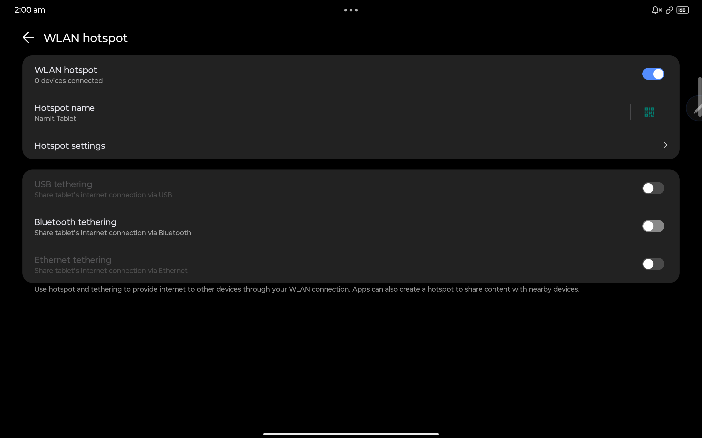

# ZUI Hotspot Fix

Fix missing **Hotspot toggle** on Lenovo ZUI / ZUXOS devices.

This LSPosed module restores:

- Hotspot Quick Settings tile  
- Tethering / Hotspot settings page  

⚡ No system modification required — everything works via runtime hooks.

---


---

## 📦 Module info

- **Module ID (package name)**: `com.xeno.zuihotspotfix`  
- **Framework**: LSPosed / Xposed (classic API 82)  
- **Source code**: https://github.com/Xeno761/ZuiHotspotFix  
- **Downloads (APK)**: https://github.com/Xeno761/ZuiHotspotFix/releases  

---

## 📸 Screenshots

| Quick Settings Tile | Tethering Page | Hotspot Settings |
|---------------------|----------------|------------------|
|  |  |  |

---

## ⚠️ Experimental / device‑specific

Tested only on:

- **Lenovo Idea Tab Pro**  
- **ZUXOS 1.5.10.060 (Android 16)**  
- China ROM manually converted to global  

Other Lenovo devices / firmware versions may behave differently.

Use at your own risk.

---

## ❓ Why this exists

Some Lenovo global ROMs disable hotspot functionality even when hardware support exists.  
This module bypasses those artificial OEM restrictions and re‑enables hotspot where the UI and backend code still exist.

---

## 🔧 Features

- Forces the **Hotspot Quick Settings tile** to always be available.
- Re‑enables the **Hotspot / Tethering settings page** (when present in the ROM).
- Works entirely via **LSPosed hooks** (no system partition modification).
- No smali edits or system file patching required.

---

## ⚙️ How it works (technical)

> For developers and power users

- Hooks `com.android.systemui.qs.tiles.HotspotTile`  
  → Overrides the availability check to always return `true`.

- Hooks `com.lenovo.common.utils.LenovoUtils.isSupportTether(android.content.Context)`  
  → Forces tethering support to `true`, bypassing OEM region / config checks.

- Uses classic Xposed API:

  ```gradle
  compileOnly "de.robv.android.xposed:api:82"
  ```

✔ Runs fully under LSPosed  
✔ No system partition changes  

---

## ✅ Requirements

- Rooted Android device  
- **LSPosed** (or compatible Xposed implementation)  
- Lenovo ZUI / ZUXOS‑based ROM where hotspot is disabled artificially but still present in SystemUI/Settings

---

## 🚀 Installation

1. Download the latest APK from the [Releases](https://github.com/Xeno761/ZuiHotspotFix/releases) page.  
2. Install the APK like a normal app.  
3. Open **LSPosed**.  
4. In **Modules**, enable **ZUI Hotspot Fix**.  
5. In **Scopes**, enable:
   - `com.android.systemui`
   - `com.android.settings`
6. Reboot the device.

---

## ✅ Expected behavior

After successful installation and reboot:

- The **Hotspot tile** should appear in Quick Settings (or become selectable in the tile editor).  
- The **Tethering / Hotspot page** should be visible in Settings (if your ROM still includes that UI).  

---

## ⚠️ Known limitations

- Tested only on Lenovo Idea Tab Pro, ZUXOS 1.5.10.060 (Android 16), China → global conversion.  
- Other devices / ROMs may:
  - Use different class or method names.
  - Include additional OEM region or feature checks.
- Future firmware updates may change SystemUI or Settings internals and break the hooks.

This module cannot restore features whose UI and code have been fully removed from the ROM.

---

## 🛠️ Troubleshooting

**Module not visible in LSPosed**

- Check that the app is installed.  
- Ensure `xposedmodule` and `xposedminversion` meta‑data are present in `AndroidManifest.xml`.  
- Reinstall the module if needed.

**Hotspot tile still missing**

- Confirm `com.android.systemui` is enabled in the module scope.  
- Open LSPosed logs and look for `HotspotFix` / `ZuiHotspotFix` messages to confirm hooks ran.

**Settings page still hidden**

- Confirm `com.android.settings` is enabled in the module scope.  
- Some ROMs remove the Settings UI entirely; this module cannot recreate deleted screens.

---

## 🔐 Safety

- No system files or partitions are modified.  
- All changes happen at runtime in app processes via LSPosed hooks.  
- Uninstalling the module and rebooting restores stock behavior.

This is still a root‑level modification — use it responsibly.

---

## 🙏 Credits

- LSPosed / Xposed developers for the framework and APIs.  
- Lenovo / ZUXOS firmware as the base system.  

---

## 👤 Author

**Xeno** ([GitHub: @Xeno761](https://github.com/Xeno761))
