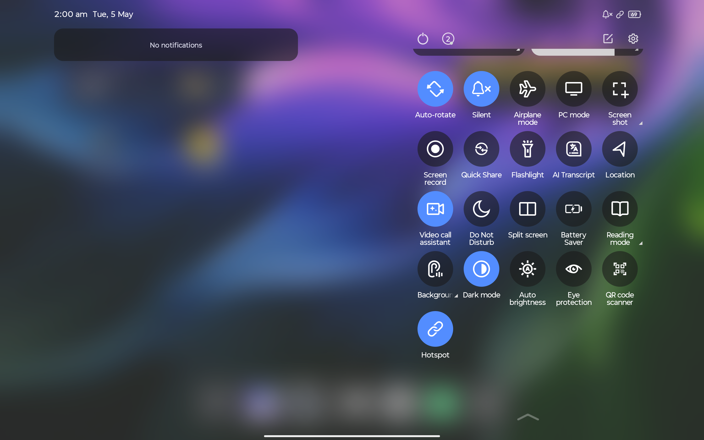
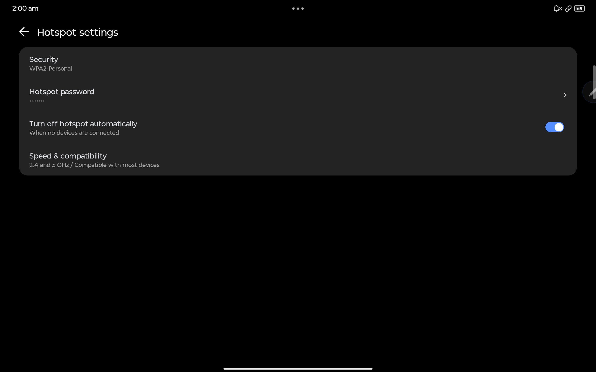

# ZUI Hotspot Fix

Fix missing **Hotspot toggle** on Lenovo ZUI / ZUXOS devices.

This LSPosed module restores:
- Hotspot Quick Settings tile  
- Tethering / Hotspot settings page  

⚡ No system modification required — everything works via runtime hooks.

---

---

## 📸 Screenshots

| Quick Settings Tile | Tethering Page | Hotspot Settings |
|--------------------|---------------|---------|
|  |  |  |

---

## ⚠️ Experimental / Device-Specific

Tested only on:

- **Lenovo Idea Tab Pro**
- **ZUXOS 1.5.10.060 (Android 16)**
- China ROM manually converted to global  

Other Lenovo devices / firmware versions may behave differently.

Use at your own risk.

---

## ❓ Why this exists

Some Lenovo global ROMs disable hotspot functionality even when hardware support exists.  
This module bypasses those artificial OEM restrictions.

---

## 🔧 Features

- Forces the **Hotspot Quick Settings tile** to always be available
- Re-enables **Hotspot / Tethering settings page**
- Works entirely via **LSPosed hooks (no system modification)**
- No smali edits or system file patching required

---

## ⚙️ How it works (Technical)

> For developers and power users

- Hooks `com.android.systemui.qs.tiles.HotspotTile`  
  → Overrides availability check → always returns `true`

- Hooks `com.lenovo.common.utils.LenovoUtils.isSupportTether(Context)`  
  → Forces tethering support → bypasses OEM restriction

- Uses classic Xposed API:

de.robv.android.xposed:api:82

✔ Runs fully under LSPosed  
✔ No system partition changes  

---

## 📦 Requirements

- Rooted Android device  
- LSPosed (or compatible framework)  
- Lenovo ZUXOS-based ROM where hotspot is disabled artificially  

---

## 🚀 Installation

1. Download latest APK from Releases  
2. Install APK normally  
3. Open **LSPosed**
4. Enable module → `ZuiHotspotFix`
5. Set scopes:
 - `com.android.systemui`
 - `com.android.settings`
6. Reboot device  

---

## ✅ After Installation

- Hotspot tile should appear in Quick Settings  
- Tethering / Hotspot page should be visible in Settings  

---

## ⚠️ Known Limitations

- Tested only on Lenovo Idea Tab Pro (Android 16)
- Other devices may:
- Use different class names  
- Have additional region locks  
- Future updates may break hooks  

---

## 🛠️ Troubleshooting

**Module not visible in LSPosed**
- Check `xposedminversion` in manifest  
- Reinstall module  

**Hotspot tile missing**
- Ensure `com.android.systemui` is enabled in scope  
- Check LSPosed logs  

**Settings page still hidden**
- Ensure `com.android.settings` is enabled  
- Some ROMs remove UI entirely (cannot be restored)  

---

## 🔐 Safety

- No system files modified  
- No partitions touched  
- Fully runtime-based  

Uninstall + reboot restores stock behavior.

⚠️ Root-level modification — use responsibly  

---

## 🙏 Credits

- LSPosed / Xposed developers  
- Lenovo / ZUXOS firmware  

---

## 👤 Author

**@Xeno761**
